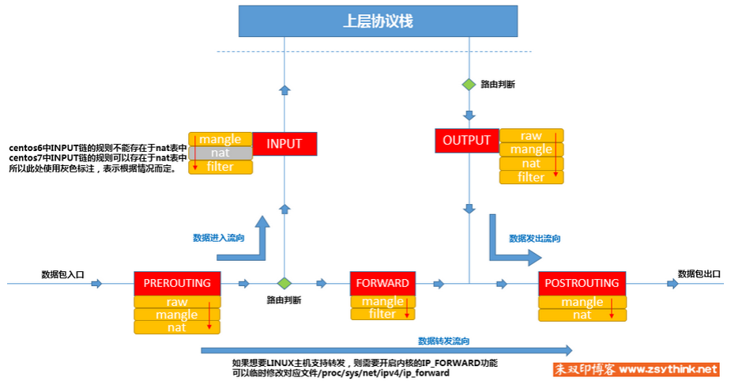
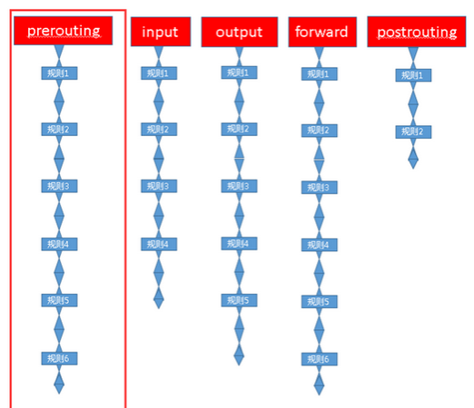

iptables其实不是真正的防火墙，可以把它理解成一个客户端代理，将用户的安全设定执行到对应的“安全框架”中，这个框架才是真正的防火墙，它的名字叫netfilter。

**netfilter才是防火墙真正的安全框架（framework），netfilter位于内核空间。**

netfilter/iptables组成Linux平台下的包过滤防火墙。

**数据经过防火墙的流程**

#### 四表五链

**链**：多条报文匹配规则形成一条链。每个经过的报文都需要将链上的规则匹配一边，如果符合条件则执行规则对应的动作。

INPUT链：进来的数据包应用此规则链中的策略

OUTPUT链：外出的数据包应用此规则链中的策略

FORWARD链：转发数据包时应用此规则链中的策略

PREROUTING链：对数据包作路由选择前应用此链中的规则（所有的数据包进来的时侯都先由这个链处理）

POSTROUTING链：对数据包作路由选择后应用此链中的规则（所有的数据包出来的时侯都先由这个链处理）

**表**：把链上具有相同功能的规则集合叫做表。

filter表：负责过滤功能

nat表：网络地址转换

mangle表：拆解报文，做出修改，并重新封装

raw表：决定数据包是否被状态跟踪机制处理

**表链关系**：某些链上注定不会包含某类规则

PREROUTING：raw表，mangle表，nat表

INPUT：mangle表，filter表（centos7有nat表，6没有）

FORWARD：mangle表，filter表

OUTPUT：所有表

POSTROUTING：mangle表，nat表

**优先级**：当四张表处于同一条链时，执行的优先级

**raw>>mangle>>nat>>filter**

#### 规则简介

根据指定的匹配条件来尝试匹配每个流经此处的报文，一旦匹配成功，则由规则后面指定的处理动作进行处理。

**基本匹配条件**：

源地址source IP、目标地址Destination IP

**拓展匹配条件**：

源端口source Port、目标端口Destination Port

**处理动作**：（常用动作）

ACCEPT：允许数据包通过

DROP：直接丢弃数据包

REJECT：拒绝数据包通过

SNAT：源地址转换

MASQUERADE：自动化SNAT，不需要指定源ip，指定获取发送数据网卡的ip（适用于发送数据网卡ip不定）

DNAT：目标地址转换

REDIRECT：本机做端口映射

LOG：在/var/log/messages文件中记录日志信息
