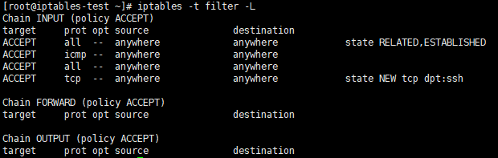
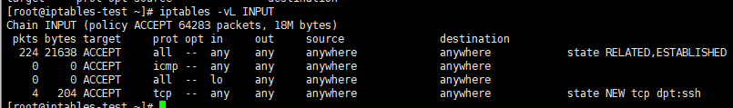
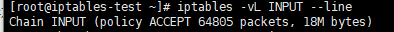

iptables的实际操作过程中，都是以“表”作为操作入口。

**查询filter表中的规则**

```
iptables -t 表名 -L
```



参数

**-t**：选择对应的表，如果使用-t，默认为filter表

**-L**：列出规则

**-v**：列出详细信息

**-n**：不对IP地址进行反解，直接显示IP地址

**-x**：显示精确的数值

**--line-numbers**：列出规则的序号，可以缩写成--line


**查询filter表中的INPUT链**（-t省略默认filter）

```
iptables -vL 链名
```



规则中字段的含义

**pkts**：规则匹配到的报文个数

**bytes**：规则匹配到的报文包的大小总和

**target**：规则匹配成功后需要采取的动作

**prot**：规则对应的协议

**opt**：规则对应的选项

**in**：数据包进入的网卡

**out**：数据包流出的网卡

**source**：源地址（单独ip或网段）

**destination**：目标地址（单独ip或网段）




链后面会有policy ACCEPT，0 packets，0 bytes三部分

**policy**：表示当前链的默认策略

**packets**：表示默认策略匹配到的包的数量

**bytes**：表示当前链默认匹配到所有包的大小总和


##### 增加规则

```
iptables -t 表名 -I 链名 匹配条件 -j 动作
```

**-I**：指将“规则”插入到哪个链中，-l表示insert。

**-j**：指当“匹配条件”被满足时，所对应的动作。

```
iptables -t 表名 -A 链名 匹配条件 -j 动作
```

**-A**：指在对应链中“追加规则”，-I是首部插入规则，-A在尾部追加规则

##### 在对应链的对应位置插入规则

```
iptables -t 表名 -I 链名 编号 匹配规则 -j 动作
```

这样新增的规则编号即为设定的编号，编号根据--line-numbers查看

##### 删除规则

根据规则编号去删除规则

```
iptables -t 表名 -D 链名 编号 匹配条件 -j 动作
```

**-D**：表示删除规则

**-F**： flush，删除指定链中的所有规则

根据匹配添加和动作删除规则

```
iptables -D 匹配条件 -j 动作
```

删除所有表中的所有规则

```
iptables -t 表名 -F
```

删除表中指定链的所有规则

```
iptables -t 表名 -F 链名
```

##### 修改规则

修改指定链的默认策略（即链后面的policy）

```
iptables -t 表名 -P 链名 动作
```

修改规则中的动作

```
iptables -t 表名 -R 链名 编号 规则原先匹配条件 -j 动作
```

**-P**：修改整条链的默认策略（默认动作）

**-R**：表示修改对应链中的规则的动作，使用-R选项时同时指定对应链以及规则对应的序号，并且规则中原本的匹配条件不可省略

##### 保存规则

centos6上

```
service iptables save
```

在centos7中，使用了firewall代填了原理的iptables service。但是可以yum安装iptables-services。就可以使用6上一样的命令