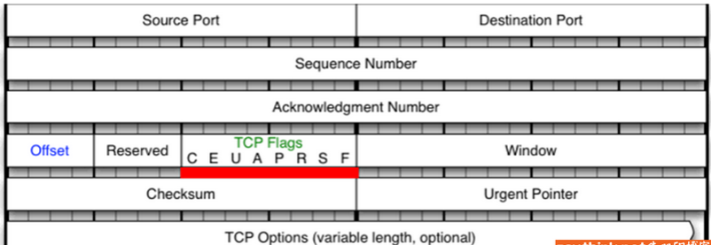

#### tcp的--tcp-flag匹配模块

tcp头结构



**--tcp-flags**：用来匹配指定的TCP标记，有两个参数列表（列表内部是用逗号分隔，列表之间空格分开）

第一个参数检查，第二个参数匹配（即哪些标志位为1）

```
iptables -A INPUT -p tcp -m tcp --dport 22 --tcp-flags SYN,ACK,FIN,RST,URG,PSH SYN -j REJECT
或 iptables -A INPUT -p tcp -m tcp --sport --tcp-flags ALL SYN -j REJECT
```

可用的标志：SYN、ACK、FIN、RST、URG、PSH、ALL、NONE

#ALL指选定所有的标记，NONE是未指定任何标记


可以使用--syn匹配tcp第一次握手，相当于--tcp-flags SYN,RST,ACK,FIN SYN

```
iptables -A INPUT -p tcp -m tcp --dport 22 --syn -j REJECT
```


udp拓展模块

icmp拓展模块

state拓展模块