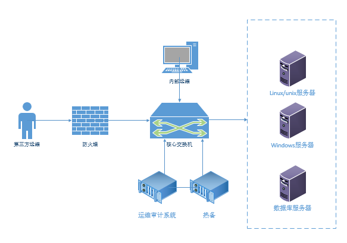
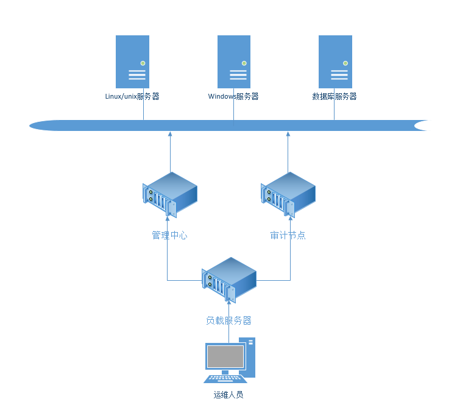
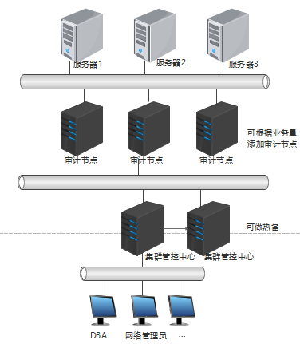
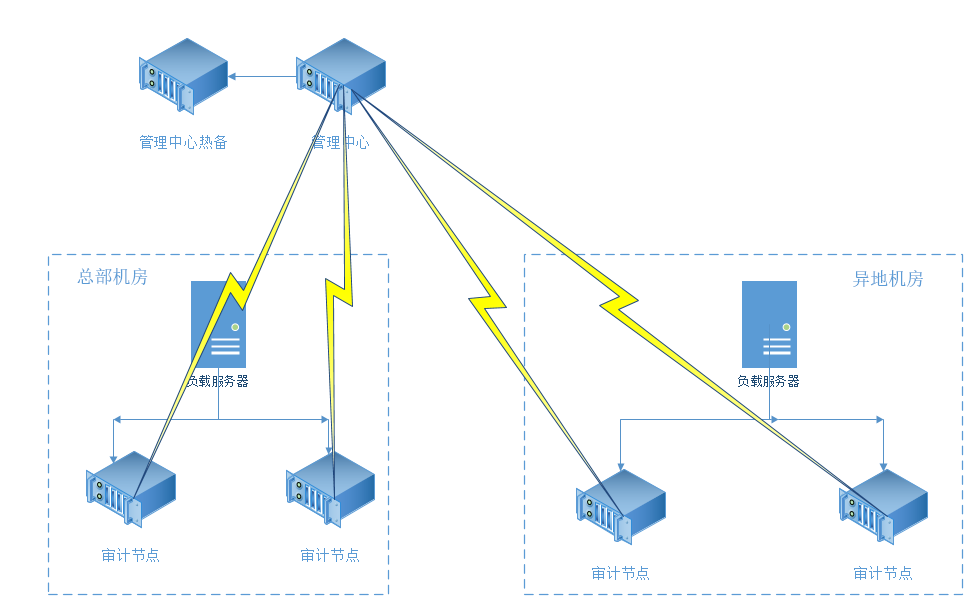

#### 一、单活部署（热备HA）

  对于中小型企业客户，内部资产数量相对较少，单台堡垒机的性能就可以满足时（图形200，字符1000），就可以在客户网络中接入一台堡垒机进行审计。但是对于运维的连续性又有要求，不期望由于堡垒机的异常故障导致正常运维任务中断太长，可以部署热备保证系统的高可用性，避免单机故障引起的正常运维中断。

  设备数量：至少2台。

  部署拓扑图：

  部署方式：物理旁路，逻辑网关。保证高可用，采用双机热备。

  部署条件：保证两个运维审计系统网络与访问服务器可达，协议开放，两台使用一个虚IP，访问虚IP即可。

  正在使用的运维审计系统在正常情况下的所有配置信息都会同步到热备机上面。当活动的运维审计系统突然发生故障，导致无法正常运维的时候，能够在很短的时间内立即切换到热备机，保证正常的运维工作。

#### 二、双活部署

  对于部分使用运维审计系统的客户，他们有两台运维审计系统，想让两台运维审计系统都来做运维审计。不用做热备部署，因为热备同时只有一台在工作。所以我们就可以使用集群的方式来实现，但光是两台运维审计系统使用集群会有一个问题，中心与节点无法实现负载均衡，需要手动访问这两台运维审计系统。那我们就在原有的集群上再加上一套第三方负载均衡服务器对访问运维审计系统的流量进行负载。可以使用开源的LVS负载或者商用的F5、A10等产品。

  设备数量：至少2台。

  部署拓扑图：

  部署方式：物理旁路，逻辑网关。通过负载均衡分流访问管理中心或是审计节点。

  部署条件：运维审计系统、服务器和负载均衡网络可达，协议开放。

  我们为客户实现了两台运维审计系统双活部署。但是存在一点，管理中心如果故障，会导致审计节点5分钟不能使用，这样导致整套运维审计体系就不能使用。我们可以对管理中心做HA，保证管理中心故障能够及时切换正常，保证整个系统正常运行。

#### 三、本地+自带负载集群部署

  客户本地机房比较大，单台或少量的运维审计系统难以维持正常的运维工作。我们就可以采用集群的部署方式对客户的资产进行管控。集群中心对审计节点进行负载，审计节点做运维，集群中心对用户身份、设备账号、密码、权限及审计的统一管控。但是集群中心如果出现故障，会导致审计节点也无法工作。所以也需要在集群中心做HA，保证中心的高可用，避免出现异常导致整个系统无法正常工作。

  设备数量：至少4台。

  部署拓扑图：

  部署方式：物理旁路，逻辑网关。通过集群部署，能够对资产进行统一管理，实现集中授权、集中认证、集中审计，方便用户统一管理和便捷使用，且自身负载分摊运维流量，提高系统整体性能。

  部署条件：运维审计系统与服务器网络可达，协议开放。

#### 四、异地地+第三方负载集群部署

  客户如果体量比较大，在全国各地有多个数据中心机房。当各地的网络通信比较良好的话，可以在总部的管理中心做集群和负载。这样部署就会带来一个问题，所有审计的流量都需要先到总部进行负载，然后在分流到审计节点，当网络通信比较差的时候，会导致访问特别慢或是丢包，影响体验甚至无法正常服务。对于这个问题，我们在各地数据中心使用第三方负载均衡设备对审计节点进行负载，管理中心在总部只对所有的运维审计系统的资产、配置信息等进行管理，实际的运维直接在本地进行负载后访问。同时中心的管理节点还是一样需要做HA，避免中心的单点故障。

  设备数量：至少6台（两地）

  部署拓扑图：

  关于第三方负载均衡，可通过以下两种模式进行支持：

1. 可配备单独的负载均衡产品（F5，A10）进行并发负载，将运维并发自动负载到节点设备，提供高性能支持。

2.  通过DNS智能解析的方式进行负载，将审计系统中心和节点的IP绑定到一个域名，通过域名智能解析实现负载效果，访问系统时通过域名进行访问即可进行自动负载。

  部署方式：物理旁路，逻辑网关，中心与节点网络可达。通过集群中对所有审计节点的资产及配置进行统一管理。本地负载避免网络问题干扰，分摊运维流量，提高系统性能。

  部署条件：运维审计系统与服务器网络可达，协议开放。

#### 五、ACL策略涉及的端口

运维终端开放端口

|  端口号   | 协议  |            用途            |
| :-------: | :---: | :------------------------: |
|   20,21   |  FTP  |      提供FTP代理服务       |
|    22     |  SSH  |    提供字符终端代理服务    |
|    443    | HTTPS |    提供web页面访问服务     |
|   3389    |  RDP  |    提供图形终端代理服务    |
|   3390    |  RDP  |    提供KVM应用发布服务     |
|   3391    |  RDP  |      提供应用发布服务      |
| 1984,1985 |   -   | 提供图形类审计录像回放服务 |
|    80     | HTTP  | 提供字符类审计录像回放服务 |

资产开发端口

| 端口号 |   协议   |                     用途                     |
| :----: | :------: | :------------------------------------------: |
| 22,21  |   FTP    |                 支持FTP运维                  |
|   22   | SSH/SFTP |              支持SSH、SFTP运维               |
|   23   |  TELNET  |                支持TELNET运维                |
|  3389  |   RDP    |                 支持RDP运维                  |
|  5900  |   VNC    |                 支持VNC运维                  |
|  177   |   X11    |                 支持X11运维                  |
|   80   |   HTTP   |        支持HTTP运维及windows账号改密         |
|  443   |  HTTPS   |                支持HTTPS运维                 |
| 自定义 |    -     | 支持其他数据库、第三方运维工具以及费默认端口 |

