MetaMask是一款在chrome浏览器和firefox浏览器上的以太坊拓展插件，它就具备了类似 Mist 的钱包功能，允许用户管理自己的账户，通过 Web3 JavaScript API，让 DApp 与以太坊区块链实现交互。

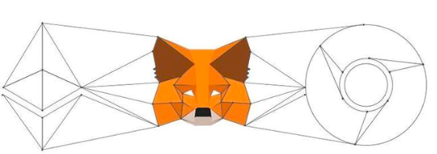


下面就直接介绍如何去安装使用MetaMask这个钱包工具。

#### 浏览器环境

需要firefox或者chreme浏览器

#### 安装MetaMask插件

1.打开chrome浏览器，地址栏输入：

```
chrome://extensions/
```

或者在更多工具内选择拓展程序

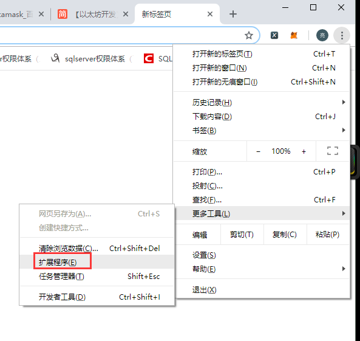

2.点击左边圈中位置，展开，在下方找到Chrome网上应用商店（可能需要翻墙）

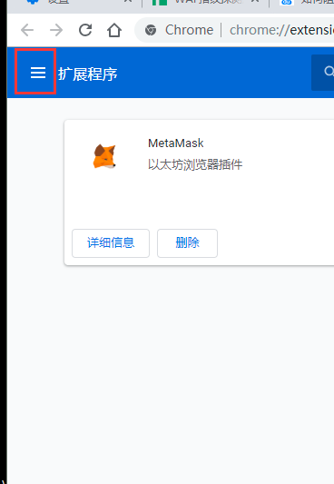

3.搜索栏搜索MetaMask

4.添加到Chrome，安装完成


#### 创建MetaMask账号

1.安装完成在弹出的页面创建新账号

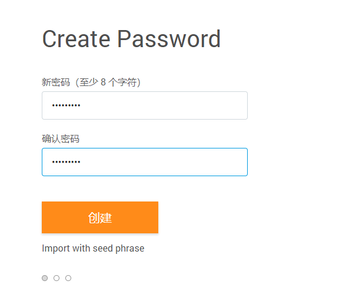

2.跟着提示一步步往下操作

3.保存你的助记词，下次登录其他位置时可以直接通过助记词导入

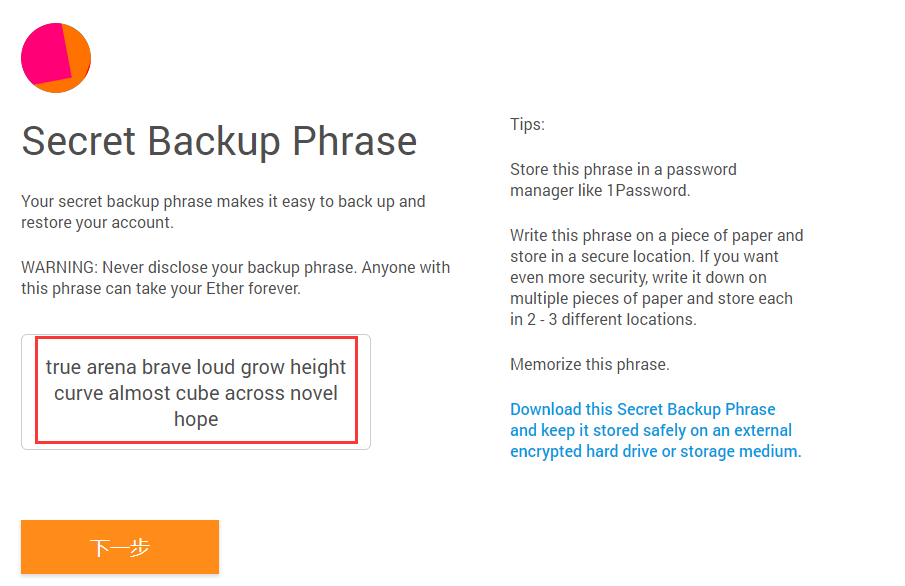

4.选择助记词填入，完成创建，进入首页

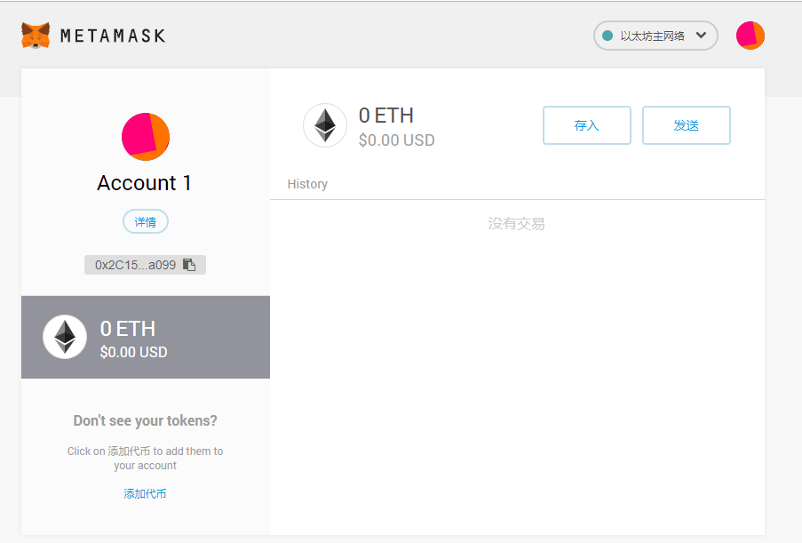


#### 连接私链网络

1.选择网络，点击自定义RPC

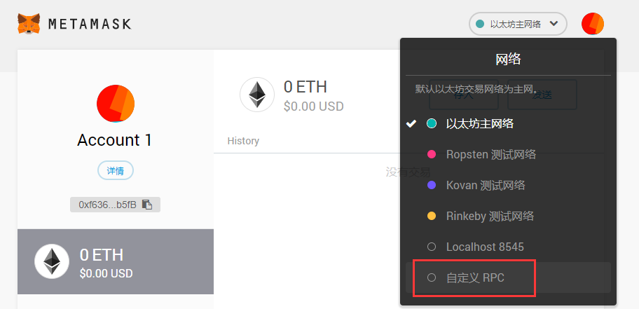

2.在New Network输入私链网络及ChainId

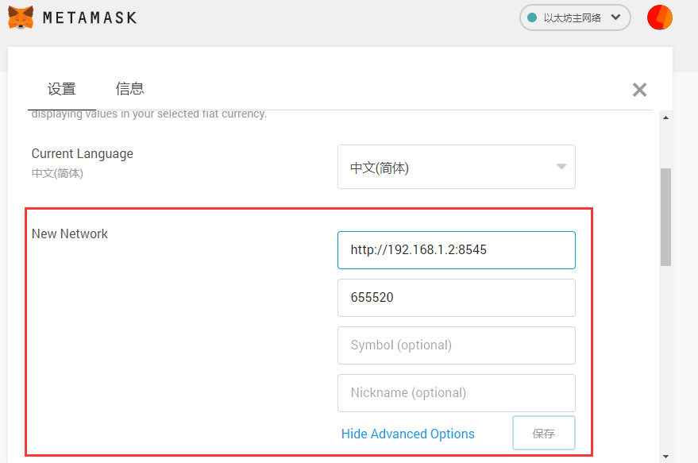

3.设置成功，选择该私链网络后，右上角网络会显示设置的网络

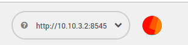

#### 导入账号

1.选择右上角头像，点击选择下拉框的导入账号

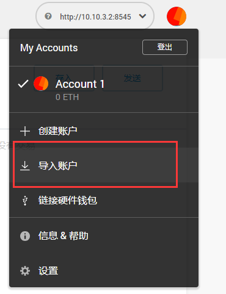

2.类型选择json文件，导入以太坊用户账号文件，输入以太坊用户的密码

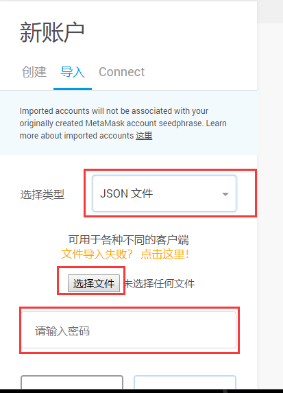

3.导入的账号出现在用户列表中（确定的是该网络私链中的账号，不然无法显示已有的以太币及无法转账）

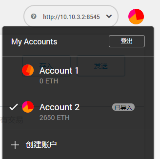

#### 发起交易

1.选择需要转账的帐户，点击发送

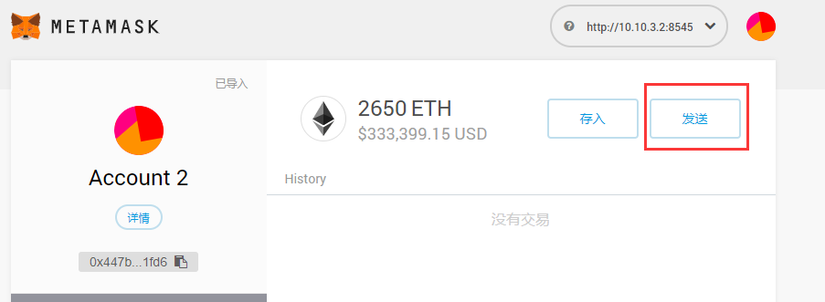

2.填入需要转账的目标账号，以及转账金额

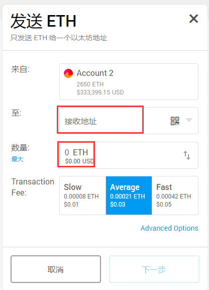

3.可以在高级设置将Gas设置为0，即不需要转账手续费。（上个图中的Advance Option）

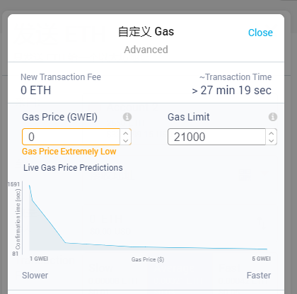

4.点击下一步完成交易（成功交易需要矿工记录区块）