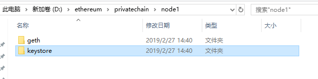

跟着网上的教程，尝试自己搭建一个以太坊私链，可能会运用到工作上。

### windows以太坊私链

#### 下载安装geth

下载地址：https://geth.ethereum.org/downloads/

上面有针对不同系统的安装程序，下载自己系统的安装进行安装就可以。


我下载的是windows版本，下载后是个exe文件，直接安装就好。然后把geth的安装目录加到环境变量path中。通过命令行，输入geth version查看是否安装配置完成。


这个时候，我们的以太坊环境已经搭建好了。

#### 初始化创世区块

##### 新建创世文件

新建空的文件夹，在里面创建一个文件，文件名所以，我就叫first.json，文件内容如下：

```
{ 
"config": { 
"chainId": 10, 
"homesteadBlock": 0, 
"eip155Block": 0, 
"eip158Block": 0 
}, 
"alloc" : {}, 
"coinbase" : "0x0000000000000000000000000000000000000000", 
"difficulty" : "0x20000", 
"extraData" : "", 
"gasLimit" : "0x2fefd8", 
"nonce" : "0x0000000000000042", 
"mixhash" : "0x0000000000000000000000000000000000000000000000000000000000000000", 
"parentHash" : "0x0000000000000000000000000000000000000000000000000000000000000000", 
"timestamp" : "0x00" 
}
```

##### 初始化区块链

打开cmd窗口，切换到创世文件所在的目录，执行命令：

```
geth --datadir .\node1 init first.json
```

--datadir参数指定数据存放的目录


出现Successfully表示初始化成功。

然后会发现目录下多了个文件夹



其中geth\chaindata是存放区块数据，keystore是存放账户数据


#### 启动节点

执行命令，可以将命令写在bash脚本，方便下次执行：

```
geth --rpc --nodiscover --datadir node1 --port 30303 --rpcapi "db,eth,net,web3" --rpccorsdomain "*" --networkid 1001 --ipcdisable console
```

> --rpc 启用ipc服务，默认端口号8545
>
> --nodiscover 关闭p2p网络的自动发现，需要手动添加节点（开启会发现公网地址）
>
> --port 指定网络监听端口，默认30303
>
> --rpcapi 指定可以通过rpc调用的对象
>
> --rpccorsdomain 指定访问API的domain地址，设置为“*”则所有都可以访问
>
> --networkid 网络标识，私有链取一个大于4的随意值。同步的节点需要一致。


出现控制台说明节点启动成功了


当不以控制台方式启动（不加console参数）且不带--ipcdisable

可以通过attach进入控制台

```
geth attach ipc：node/geth.ipc
```

#### 节点相关操作

- personal.newAccount()：创建账户；
- personal.unlockAccount()：解锁账户；
- eth.accounts：枚举系统中的账户；
- eth.getBalance()：查看账户余额，返回值的单位是 Wei（Wei 是以太坊中最小单位，类似比特币中的聪，1 ether = 10^18 Wei）；
- eth.blockNumber：列出区块总数；
- eth.getTransaction()：获取交易；
- eth.getBlock()：获取区块；
- miner.start()：开始挖矿；
- miner.stop()：停止挖矿；
- eth.coinbase：挖矿奖励的账户
- web3.fromWei()：Wei 换算成以太币；
- web3.toWei()：以太币换算成 Wei；
- txpool.status：交易池中的状态；
- admin.addPeer()：连接到其他节点


#### 多节点连接

如果需要多台主机的节点实现同步，就需要将这些节点链接到一起。前提是这些节点是使用同一个创世文件，且启动节点的时候的networkid一致，这些个节点才能够实现同步。

启动节点后，每一个节点都会生成自己的一串enode字符串，这段字符串就是用户节点之间的连接。

通过下面命令查看enode:

```
admin.nodeInfo.encode
```


在另一台节点上通过下面命令进行添加该节点：

```
admin.addPeer("enode://9e86289ea859ca041f235aed87a091d0cd594b377cbe13e1c5f5a08a8a280e62d4019ac54063ed6a1d0e3c3eaedad0b73c40b99a16a176993f0373ffe92be672@127.0.0.1:30304")
```

**注意：**填写的内容只需要到端口号，且前面的ip地址填所需连接节点的ip地址。

我们可通过下面命令查看已连接的节点信息：

```
admin.peers
```

返回节点信息


连接的主机节点就会自动连接且同步区块。


#### 转账交易

转账交易，实际上是一个账户的以太币转移到另一个账户。转账的过程需要挖矿来实现。

转账前需要解锁转账的账号：

```
personal.unlockAccount(eth.accounts[0])
```

我是把第一个账号解锁了，我拿这个账户进行转账。解锁的时候需要输入这个账户的密码。


账号如果不解锁我们进行转账会报告错误，账号每隔一段时间就会锁定

```
amount=web3.toWei(10,'ether') #将以太币转换为wei单位
eth.sendTransaction({from:eth.accounts[0],to:eth.accounts[1],value:amount})
```

要使交易被处理，必须要挖矿。这里我们启动挖矿，然后等待挖到一个区块之后就停止挖矿

```
miner.start(1);admin.sleepBlocks(1);miner.stop();
```

