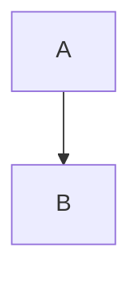
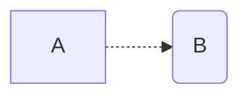
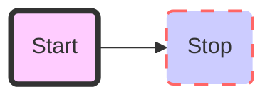

### 标题

```
# 一级
## 二级
### 三级
#### 四级
##### 五级
###### 六级
```

### 字体

##### 加粗

```
**文字**
```

**文字**

##### 斜体

```
*文字*
```

*文字*

##### 斜体加粗

```
***文字***
```

***文字***

##### 删除线

```
~~文字~~
```

~~文字~~

### 引用

```
>我是引用
```

>我是引用

### 分割线

```
---
或者
****
```

三个或者三个以上的 "-" 或 “*”

****

### 图片

```

```

图片alt：图片下方显示的内容

图片title：鼠标悬浮图上时显示的内容

### 超链接

```
[百度](http://www.baidu.com "baidu")
```

[百度](http://www.baidu.com "baidu")

### 列表

##### 无序列表

```
- a
- b
或
* a
* b
或
+ a
+ b
符合和内容有空格
```

- 1
- 2
- 3

##### 有序列表

```
1. a
2. b
3. c
点与内容有空格
```

1. a
2. b
3. c

### 表格

```
表头|表头|表头
---|:--:|---:
内容|内容|内容
内容|内容|内容
```

| 表头 | 表头 | 表头 |
| ---- | :--: | ---: |
| 内容 | 内容 | 内容 |
| 内容 | 内容 | 内容 |

第二行分隔表头与内容，而且第二行的每列冒号处在的位置及表示这一列的对其方式。两边有冒号即为居中，默认左对齐。

### 代码

##### 单行代码

```
`echo 123`
```

`echo 123`

**反引号**

##### 代码块

```
​```
if a > b:
	echo a
​```
```

### 流程图

理论上是用mermaid画流程图，mermaid支持三种图形绘制，是流程图，时序图和甘特图。

```
​```mermaid
	graph 流程图方向
	流程图内容
​```
```

##### 方向的值

> TB 从上到下
>
> BT 从下到上
>
> RL 从右到左
>
> LR 从左到右
>
> TD同TB



##### 基本图形

> id[文字] 矩形
> id(文字) 圆角矩形
> id>文字] 不对称的矩形
> id{文字} 菱形
> id((文字)) 圆形



##### 节点之间的连接

> A-->B  A带箭头指向B
>
> A---B  A不带箭头指向B
>
> A-.-B  A用虚线指向B
>
> A-.->B  A用带箭头的虚线指向B
>
> A==>B  A用加粗的箭头指向B
>
> A--描述--B  A不带箭头指向B并在中间加上文字描述
>
> A--描述-->B  A带箭头指向B并在中间加上文字描述
>
> A-.描述.->B  A用带箭头的虚线指向B并在中间加上文字描述
>
> A==描述==>B  A用加粗的箭头指向B并在中间加上文字描述

##### 自定义样式

```
style id 具体样式
```



