### 软件下载

下载地址：http://www.oracle.com/technetwork/cn/database/enterprise-edition/downloads/index.html

​	选择所需要下载的版本，复制下载链接到迅雷等下载器进行下载。直接点击会跳转到登录界面。

Oracle Database 12c第一版有两个文件，都需要下载。

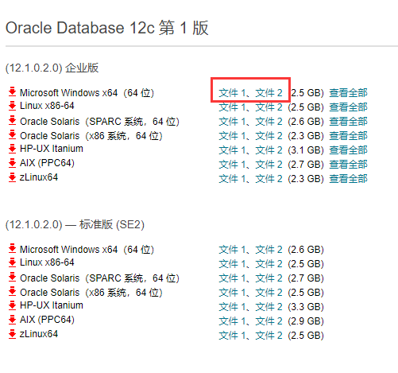

### 安装

#### 解压文件

​	下载下来的文件不带后缀，需要手动改成zip进行解压。第一版的话两个都需要解压，我由于第一版第二个文件下不下来，就直接用了第二版。第二版也一样不过只要有个压缩包。

​	注：如果在虚拟机中安装的话，windows磁盘选择30G以上。

​	解压后运行里面的setup.exe（建议使用右键管理员身份运行），等待检查文件参数后，进入安装配置界面

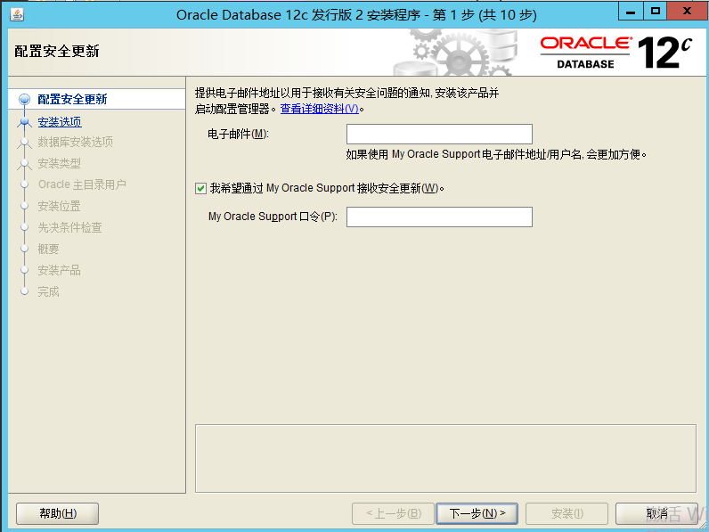

#### 配置安装更新

​	配置邮箱由于接收通知，可以不填，取消复选框，点击下一步，选择是即可

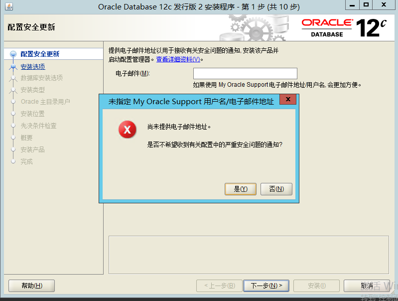

#### 安装选项

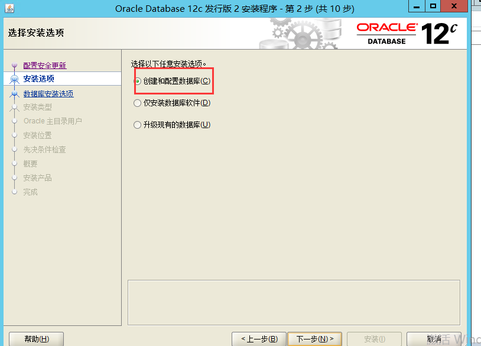

- 创建和配置数据库：安装数据库软件并创建一个数据库实例

- 仅安装数据库软件：安装数据库软件，不创建实例

- 升级现有数据库：升级低版本Oracle数据库

  初次安装，此处选择第一项。

#### 系统类

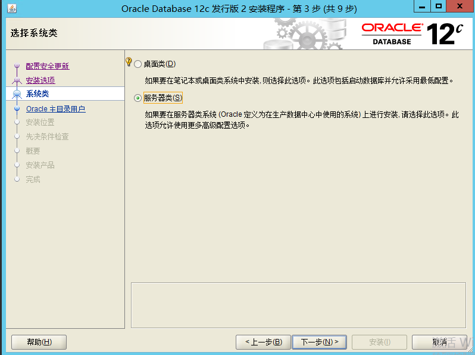

​	根据实际需要选择安装的配置。我选择的是服务器类。如果是桌面类安装的话，直接到oracle主目录用户。

#### 数据库安装选项

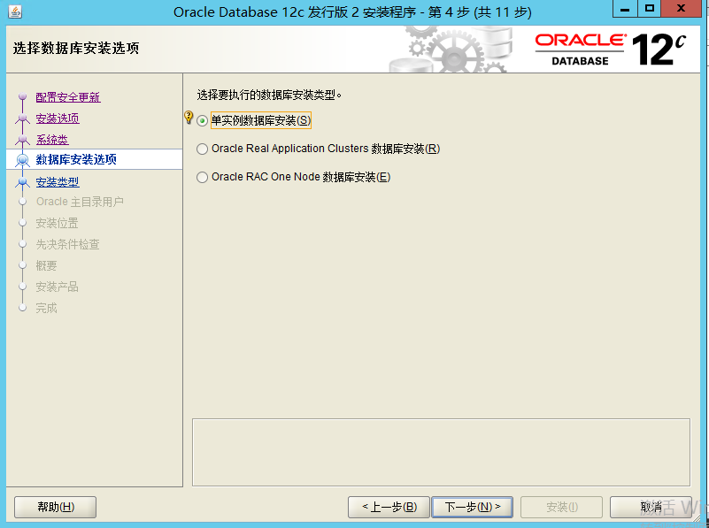

​	由于选择了服务器类，会比桌面类多一些选项。

​	这边就选择单实例数据库安装，下两项的都是集群相关。

#### 安装类型

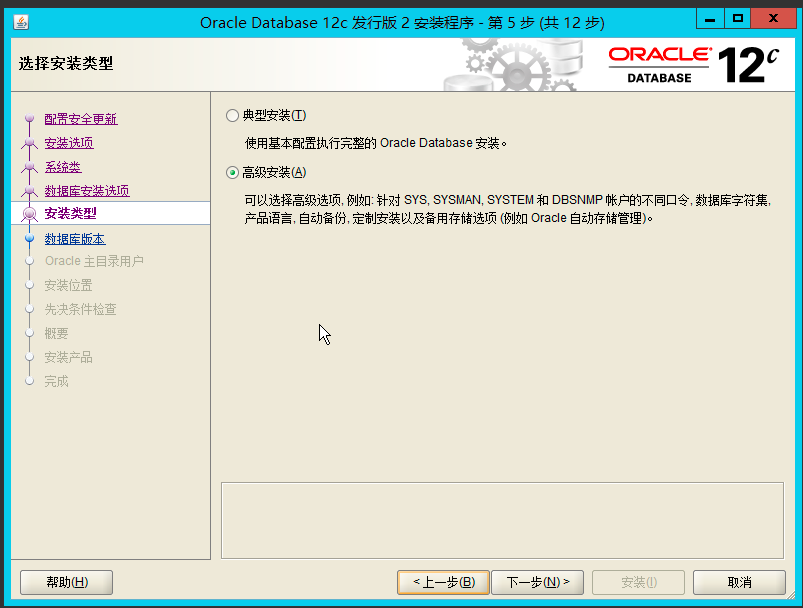

​	选择高级安装。

#### 数据库版本

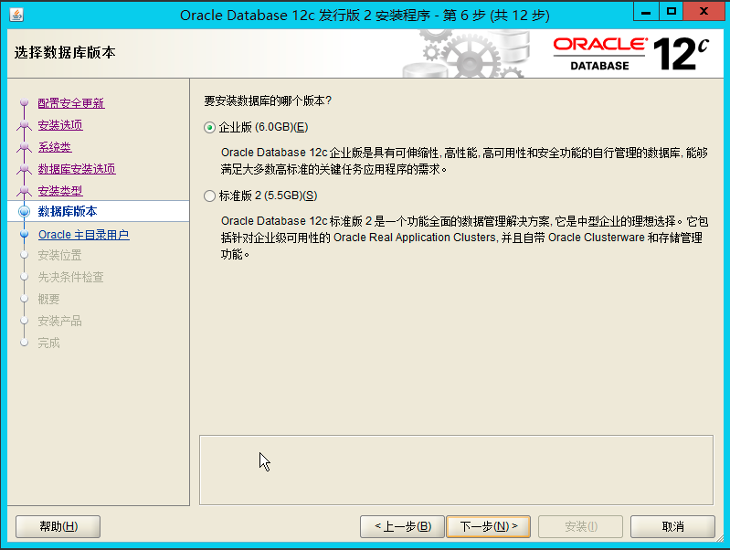

选择企业版。

#### Oracle主目录用户

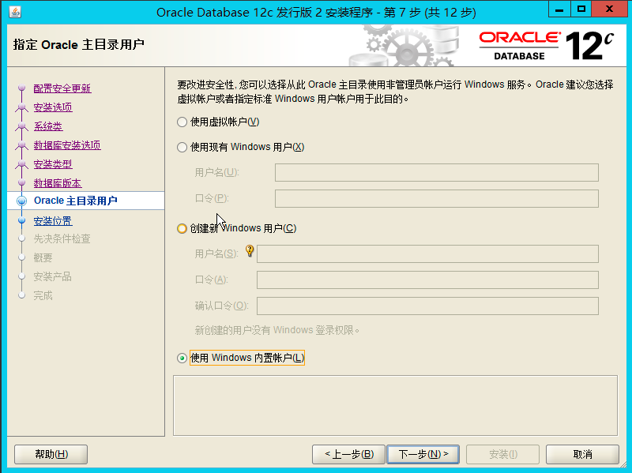

- 使用现有的Windows用户：如果选择该项，则需要指定没有管理权限的用户；
- 创建新Windows用户：创建一个新用户，输入用户名和密码，确认密码 ；
- 使用Windows内置账户选择该项：内置账户，Oracle也建议使用权限受限的账户。

我选择直接使用内置账户了。如果选择创建新用户，创建的用户名不能在window内存在，否则后面会报错。

#### 安装位置

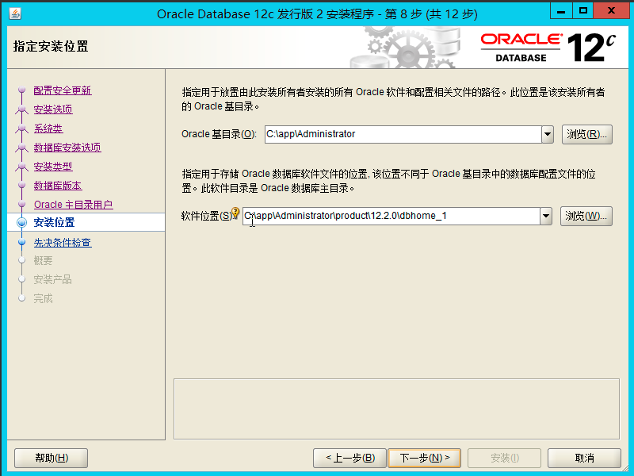

默认，直接下一步。可以根据需要更改。

#### 配置类型

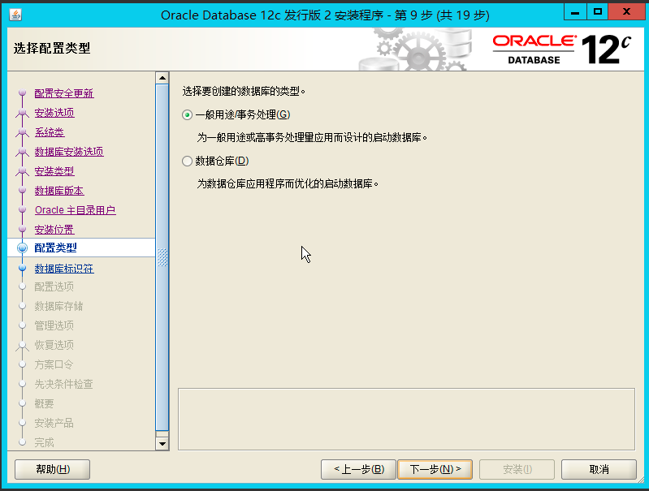

选择一般用途/事务处理。

#### 数据库标识符

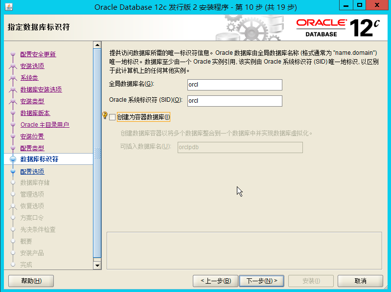

这边我不勾选创建为容器数据库。

#### 配置选项

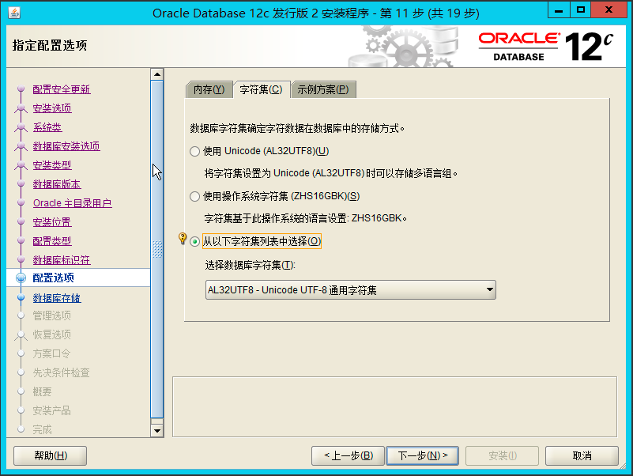

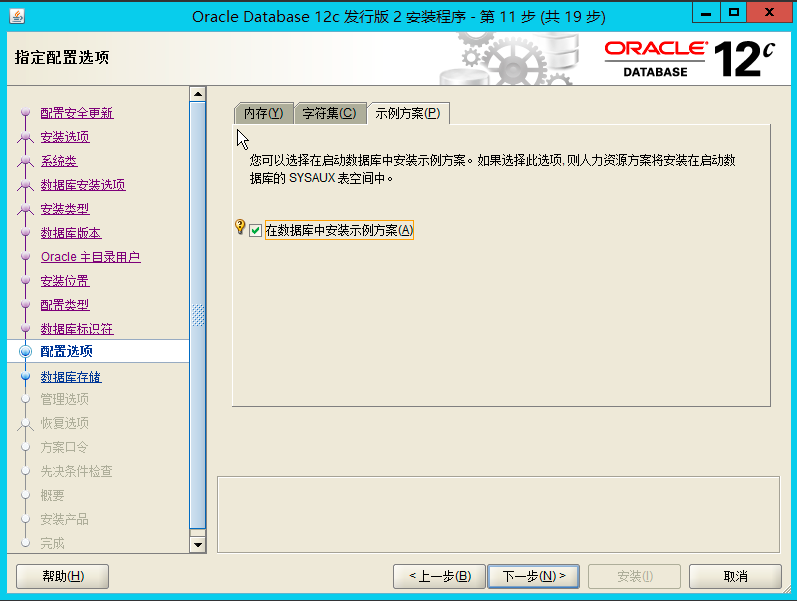

选择UTF-8字符集合选择示例

#### 数据库存储

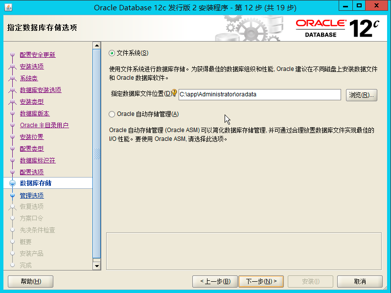

默认路径，下一步。

#### 管理选项

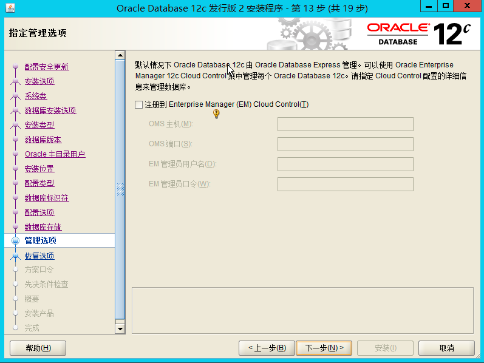

可以不填直接下一步。

#### 恢复选项

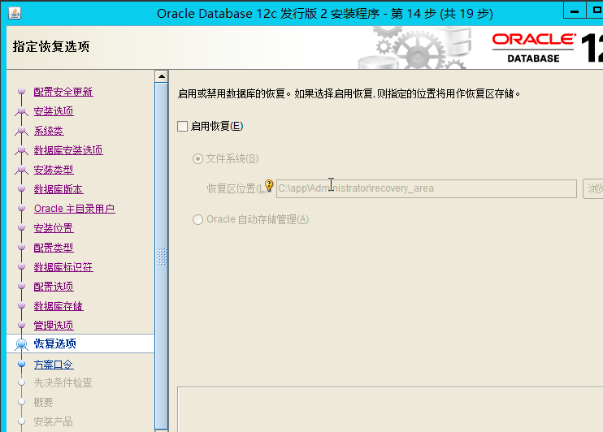

建议开启。

#### 方案口令

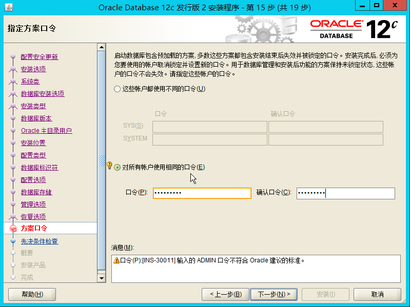

可以分开设置sys和system的口令，也可以设置相同口令。密码pldsecQ2

#### 先决条件检查

自动检查。

#### 概要

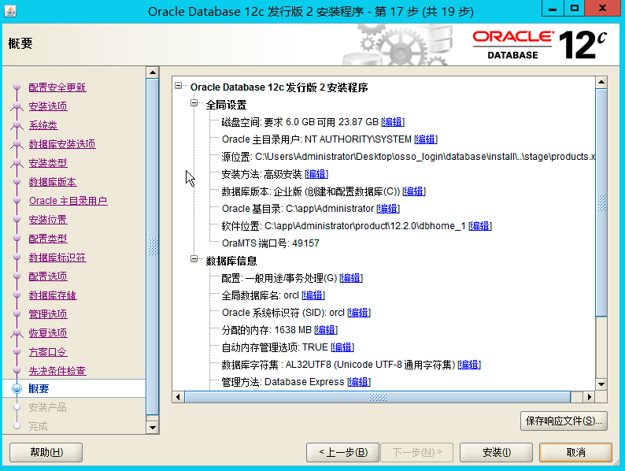

显示即将安装的内容，可以修改。

#### 安装产品

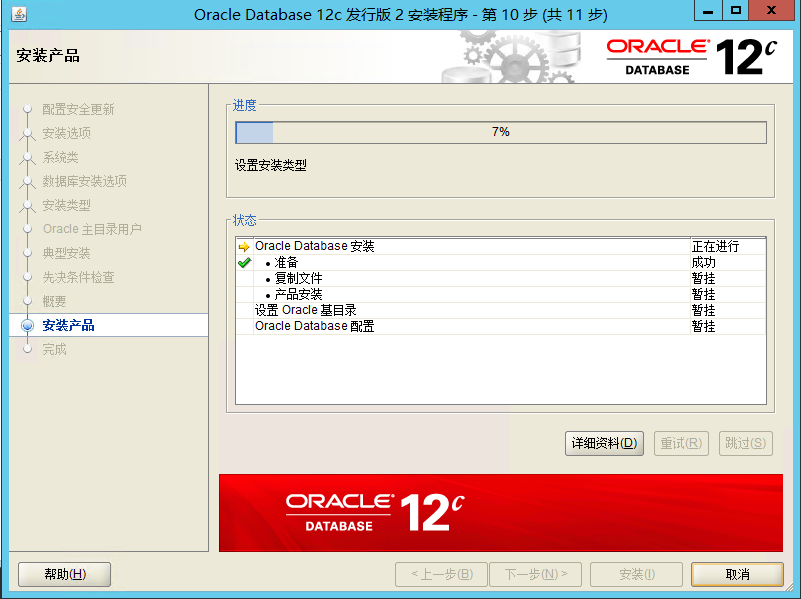

等待安装完成

12c 1版本再安装快结束的时候会弹出一个管理口令的窗口，可以解锁一下scott普通用户用于测试，也可以到时候sql语句解锁用户。