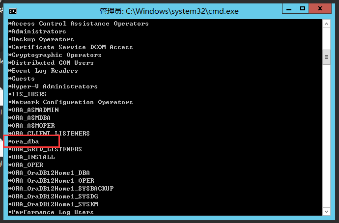

#### 简单的说，oracle要认为你是sysdba有以下3个条件

1. 你对oracle的密码文件没有进行过设置；（因为oracle默认不认证以sysdba登录的用户）
2. 你是以操作系统管理员的身份登录的（不管谁登录你的电脑，只要是用管理员身份登录的，oracle都认作为sysdba，你可以试试用来宾账户登录操作系统，那样的话，oracle就不会把你认成DBA了）；
3. 你是以as sysdba的方式登录的（只要你接了as sysdba，不管你前面加了谁的用户名密码，oracle都认为你是以sysdba身份登录，用户为sys）

当上面3个条件有一个不满足的时候，你登录的用户就不是sys了，而如果你登录的那个用户没有被授权为dba的话，那他的权限肯定就只能是普通权限了。


你无论用什么身份登入后 show user ; 看看结果是不是  sys
在操作系统认证方式下:

- 对于如果是Unix操作系统，只要以DBA组中的用户登录的操作系统，就可以以SYSDBA的身份登录数据库，不会验证SYS的口令。

- 对于windows操作系统，在oracle数据库安装后，会自动在操作系统中安装一个名为ORA_DBA的用户组，只要是该组中的用户，即可以SYSDBA的身份登录数据库而不会验证SYS的口令。也可以创建名为ORA_SID_DBA(SID为实例名)的用户组，属于该用户组的用户也可以具备以上特权。

  ```
  net localgroup
  ```

  


