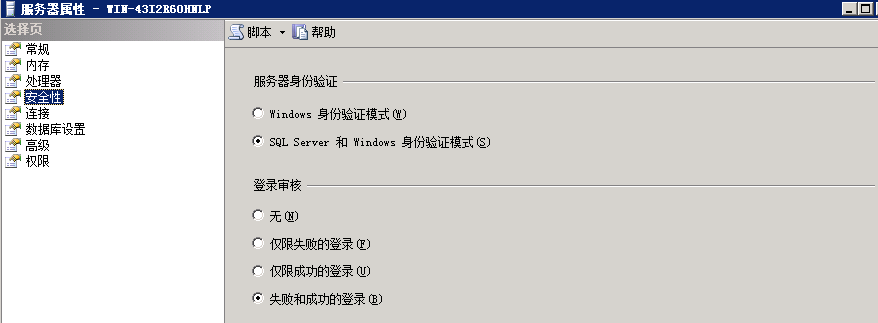
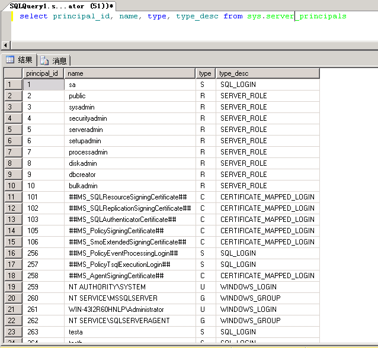
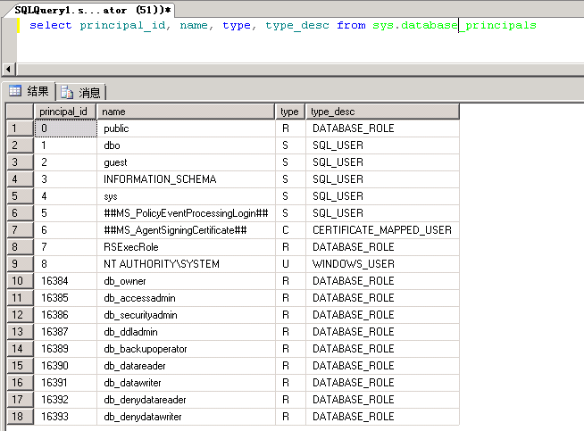
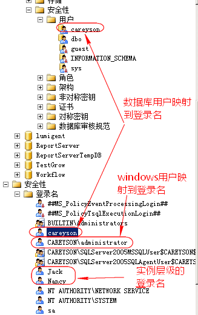
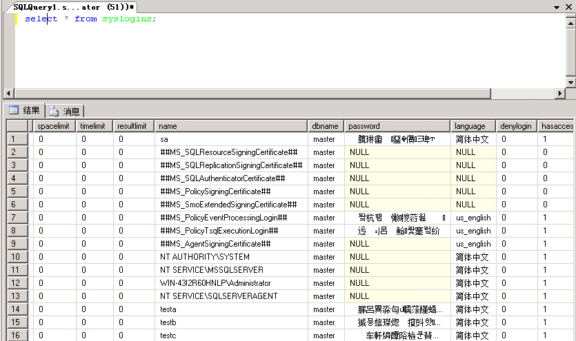

对于数据库而言，保证数据库的安全性永远是最重要的问题之一。

权限两字，一是权力，二是限制。可以理解为哪些人可以对哪些资源进行哪些操作。在SQLServer中，其中“哪些人”就是主体，“哪些资源”就是安全对象，“哪些操作”就是权限。

#### SQLServer的验证方式

在进行操作，给别人权限或者查看自己有什么权限之前，SQLServer首先需要知道你这个“主体”是不是你所声称的那个“主体”。就像平时对暗号一样，“天王盖地虎，宝塔镇河妖”就是认证身份的一种方式。对于SQLServer，在你连接SQLServer的时候就需要确认你的身份，SQLServer提供两种身份认证的模式

##### windows身份验证

windows认证就如其名，通过windows来验证主体，SQLServer并不参与认证。SQLServer完全相信windows的认证结果，所以此认证方式并不需要提供密码。即使不需要密码，windows身份验证模式也更加安全，因为windows身份认证使用了kerberos协议。是微软推荐的认证方式。

但windows身份认证在由域控制器控制网络访问下才能使用（单击也可以使用）

##### SQL Server和windows身份验证（混合模式）

混合模式其实实际上是SQLServer认证或windows身份认证，是一种或的关系。可以通过SQLServer本身认证登录，也允许通过windows身份认证登录。当通过SQLServer认证登录时，就需要账号密码，这时跟windows身份认证没有一点关系，账号密码存储在master数据库中。

设置登录验证方式很简单，直接登录SSMS后右键实例进入服务器属性，安全性下的服务器身份验证就可以进行更改

#### 主体（Principal）

主体是可以向SQLServer请求资源的实体。主体可以是个体、组或者进程。主体按照作用范围可分为三类：

- windows级别主体
- 服务器级别主体
- 数据库级别主体

windows级别的主体包括windows域登录名和windows本地登录名

服务器级别主体包括SQLServer登录名和服务器角色

数据库级别主体包括数据库用户和数据库角色以及应用程序角色

可以通过master数据库的两张视图sys.server_principals、sys.database_principals查看数据库中的主体。

windows及服务器级别主体

查询后其中包含windows登录名、SQLServer登录名、服务器角色等。

数据库级别主体

查询后其中包含SQLServer用户、windows用户、数据库角色。

#### 登录名

登录名是服务器级别的主体，但是无论是哪一个级别的主体，都需要通过登录到SQLServer实例，所以每一层级的主体都需要有一个与之对应的登录名。

对于windows级别的主体来说，windows用户会映射到登录名。数据库级别的主体，其用户必须映射到登录名。

除了自定义添加的登录名以外，还有系统添加的登录名。

##MS_PolicyEventProcessingLogin## 事件处理帐户，内部使用

##MS_PolicyTsqlExecutionLogin## TSQL语句执行帐户，内部使用

NT SERVICE\MSSQLSERVER   运行SQLSERVER服务的帐户

NT SERVICE\SQLSERVERAGENT   运行代理服务的帐户

NT Authority\System  系统内置帐户，对本地有完全控制权。工作组模式下不能访问网络资源。用于服务的运行。

NT Authority\Network Service  系统内置帐户，比SYSTEM帐户权限要小。工作组模式下以计算机凭证来访问网络资源。用于服务运行。

NT Authority\Local Service  系统内置用户，比NETWORK SERVICE帐户权限小，访问有限的本地系统资源。工作组模式下只能以匿名方式访问网络资源。用于服务运行。

sa   系统管理员拥有一切权限，权限分配的起点。

每个登录名的定义存在master数据库的syslogins表中

#### 用户

数据库用户是数据库级别的主体，用户访问数据库层面的对象。一个独立的登录账号是不能够直接访问数据库的，需要关联对应的数据库用户，根据数据库用户的权限去访问数据库。

SQLServer把登录名与用户名的关系称为映射。用登录名登录SQLServer后，在访问各个数据库时，SQLServer会自动查询此数据库中是否存在与此登录名关联的用户名，若存在就使用此用户的权限访问此数据库，若不存在就是用guest用户访问此数据库。

一个登录名能够被授权访问多个数据库，但是一个登录名在同一个数据库中只能被映射一次。即一个登录名可以对应多个用户，一个也能对应多个登录名。

角色

架构

安全对象

权限