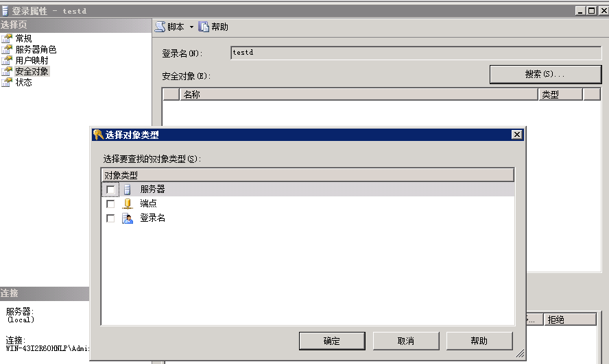

对于数据库而言，保证数据库的安全性永远是最重要的问题之一。

权限两字，一是权力，二是限制。可以理解为哪些人可以对哪些资源进行哪些操作。在SQLServer中，其中“哪些人”就是主体，“哪些资源”就是安全对象，“哪些操作”就是权限。


#### SQLServer的验证方式

在进行操作，给别人权限或者查看自己有什么权限之前，SQLServer首先需要知道你这个“主体”是不是你所声称的那个“主体”。就像平时对暗号一样，“天王盖地虎，宝塔镇河妖”就是认证身份的一种方式。对于SQLServer，在你连接SQLServer的时候就需要确认你的身份，SQLServer提供两种身份认证的模式

##### windows身份验证

windows认证就如其名，通过windows来验证主体，SQLServer并不参与认证。SQLServer完全相信windows的认证结果，所以此认证方式并不需要提供密码。即使不需要密码，windows身份验证模式也更加安全，因为windows身份认证使用了kerberos协议。是微软推荐的认证方式。

但windows身份认证在由域控制器控制网络访问下才能使用（单击也可以使用）

##### SQL Server和windows身份验证（混合模式）

混合模式其实实际上是SQLServer认证或windows身份认证，是一种或的关系。可以通过SQLServer本身认证登录，也允许通过windows身份认证登录。当通过SQLServer认证登录时，就需要账号密码，这时跟windows身份认证没有一点关系，账号密码存储在master数据库中。

设置登录验证方式很简单，直接登录SSMS后右键实例进入服务器属性，安全性下的服务器身份验证就可以进行更改


#### 主体（Principal）

主体是可以向SQLServer请求资源的实体。主体可以是个体、组或者进程。主体按照作用范围可分为三类：

- windows级别主体
- 服务器级别主体
- 数据库级别主体

windows级别的主体包括windows域登录名和windows本地登录名

服务器级别主体包括SQLServer登录名和服务器角色

数据库级别主体包括数据库用户和数据库角色以及应用程序角色


可以通过master数据库的两张视图sys.server_principals、sys.database_principals查看数据库中的主体。


<center>windows及服务器级别主体<center>

查询后其中包含windows登录名、SQLServer登录名、服务器角色等。


<center>数据库级别主体<center>

查询后其中包含SQLServer用户、windows用户、数据库角色。


#### 登录名

登录名是服务器级别的主体，但是无论是哪一个级别的主体，都需要通过登录到SQLServer实例，所以每一层级的主体都需要有一个与之对应的登录名。

对于windows级别的主体来说，windows用户会映射到登录名。数据库级别的主体，其用户必须映射到登录名。


除了自定义添加的登录名以外，还有系统添加的登录名。

##MS_PolicyEventProcessingLogin## 事件处理帐户，内部使用

##MS_PolicyTsqlExecutionLogin## TSQL语句执行帐户，内部使用

NT SERVICE\MSSQLSERVER   运行SQLSERVER服务的帐户

NT SERVICE\SQLSERVERAGENT   运行代理服务的帐户

NT Authority\System  系统内置帐户，对本地有完全控制权。工作组模式下不能访问网络资源。用于服务的运行。

NT Authority\Network Service  系统内置帐户，比SYSTEM帐户权限要小。工作组模式下以计算机凭证来访问网络资源。用于服务运行。

NT Authority\Local Service  系统内置用户，比NETWORK SERVICE帐户权限小，访问有限的本地系统资源。工作组模式下只能以匿名方式访问网络资源。用于服务运行。

sa   系统管理员拥有一切权限，权限分配的起点。


每个登录名的定义存在master数据库的syslogins表中


#### 用户

数据库用户是数据库级别的主体，用户访问数据库层面的对象。一个独立的登录账号是不能够直接访问数据库的，需要关联对应的数据库用户，根据数据库用户的权限去访问数据库。

##### 登录名与用户的关系

SQLServer把登录名与用户名的关系称为映射。用登录名登录SQLServer后，在访问各个数据库时，SQLServer会自动查询此数据库中是否存在与此登录名关联的用户名，若存在就使用此用户的权限访问此数据库，若不存在就是用guest用户访问此数据库。

一个登录名能够被授权访问多个数据库，但是一个登录名在同一个数据库中只能被映射一次。即一个登录名可以对应多个用户，一个用户也能对应多个登录名。

每个数据库的用户都存储在对应的数据库中，可以通过系统视图sys.sysusers查看用户


其中包括自定义用户，数据库角色及内置用户。

##### 内置用户

dbo用户是database owner的缩写。每个数据库建立都会有这个用户，而且这个用户是数据库级别的老大哥。每个属于sysadmin下的登录名都会映射到每个数据库的dbo用户。

guest用户是来宾用户。每个数据库建立也会建立这个用户。guest用户允许登录名没有映射到数据库用户的情况下访问数据库，但是数据库guest默认情况下是不启用的。

```
允许guest连接权限
GRANT CONNECT TO guest
收回guest连接权限
REVOKE CONNECT TO guest
```

guest用户也可以分配角色，但是可能会引起潜在的安全问题。


INFORMATION_SCHEMA和sys用户拥有系统视图


#### 角色

之前介绍了主体，服务器主体包含登录名和服务器角色。服务器角色的存在，就是为了方便操作员对服务器级别的管理。数据库角色也如此。属于某个角色的登录名或者角色就会拥有相应的权限。就像windows内的组，属于远程组就能远程连接，管理员组就拥有系统权限等等；又或者像公司里的经理，可以领到多少多少餐补，比他低一些级别的员工，可能待遇没他好甚至没有。同样登录名和用户也可以属于多个角色，不难理解，就像你在公司里身兼多职一样。

角色在数据库中又可以分为三类：

- 内置角色：这类角色在服务安装的时候就已经有了，权限时固定的，不能被删除更改（public角色可以更改权限）
- 自定义角色：根据用户自身的要求自定义权限创建的角色
- 应用程序角色：用于管理应用程序的数据访问

##### 内置角色

上面讲过，内置角色有服务器角色与数据库角色。且它们的权限时固定的。

服务器角色有以下角色及权限：

- sysadmin：可以在SQLServer中进行任何活动（该角色的权限跨越所有其他固定服务器角色）

- serveradmin：可以更改服务器范围的配置选项和关闭服务器。

- securityadmin：可以管理登录名及其属性。可以GRANT、DENY和REVOKE服务器级别与数据库级别权限。还可以重置SQLServer登录名的密码。

- processadmin：可以终止在SQLServer实例中运行的进程。

- setupadmin：可以使用T-SQL语句添加和删除链接服务器。

- bulkadmin：可以运行BULK INSERT语句。（批量导入）

- diskadmin：可以用于管理磁盘文件。

- dbcreator：可以创建、更改、删除和还原任何数据库。

- public：每个登录名都属于public角色。且无法更改具有public角色的成员身份。注意：public角色可以授予、拒绝或撤销权限。


数据库角色有以下角色和权限：

- db_owner：可以执行数据库的所有配置和维护活动，还可以删除数据库。（可视化删除的时候去除删除备份的勾选框，否则无法删除）

- db_securityadmin：可以修改自定义角色成员身份和管理权限。**此角色下的主体可能会意外权限升级。**

- db_accessadmin：可以为windows登录名、windows组和SQLServer登录名添加或删除数据库访问权限。

- db_backupoperator：可以备份数据库。

- db_ddladmin：可以在数据库中执行任何数据定义语言（DDL）命令。（DDL：数据库定义语言，如CREATE，ALTER，DROP等）

- db_datawriter：可以在所有用户表中添加删除或更改数据。

- db_datareader：可以从所有表中读取所有数据。

- db_denydatawriter：不能添加、修改或删除数据库内用户表中的任何数据。

- db_denydatareader：不能读取数据库内用户表中的任何数据。
- public：每个用户都属于public数据库角色。（最小权限）


对于系统数据库msdb还包含了特殊用途的数据库角色。就不详细介绍了，可以查看[msdn官方介绍](https://docs.microsoft.com/zh-cn/sql/relational-databases/security/authentication-access/database-level-roles?view=sql-server-2014)。


##### 应用程序角色

应用程序角色是一个数据库主体，它使应用程序能够用其自身的、类似用户的权限来运行，定义在每个数据库下面。跟数据库角色一样，应用程序角色可以用于数据库对象的权限。


可以从图中看到应用程序角色需要单独设置密码。

应用程序角色切换上下文的过程：用户执行客户端程序==>客户端程序连接到SQLServer==>应用程序用一个只有他知道的密码执行sp_setapprole存储过程==>应用程序角色名称和密码验证通过，获得应用程序角色权限==>失去用户权限，获得应用程序角色权限。

早起版本需要重启才能获取原始安全上下文，2005后sp_setapprole可创建Cookie选项，可通过sp_unsetapprole还原到其原始上下文。

#### 架构（schema）

在初识架构时，会感觉这个概念很模糊。实际上，架构就是数据库对象的集合，这个集合内包含了各种对象，如：表、视图、存储过程、索引等等。

在SQLServer2000中，user与schema有一层隐含关系，让我们很少意识到是两个不同的概念，如果我们在数据库中创建了abc，数据库后台会为我们默认创建schema【abc】，schema的名字和user的名字是相同的。

在SQLServer2005后，当使用sp_adduser存储过程创建一个用户的时候，数据库也会为我们创建一个和用户名相同的schema，这是为了兼容。当我们用create user创建数据库用户的时候，我们可以指定一个已经存在的schema作为默认的schema。如果不指定，则该用户所默认的schema为dbo schema。dbo架构就好比是一个大的公共房间。

如果把数据库看成一个仓库，仓库有很多的集装箱（schema），一个schema就代表一个集装箱，table等对象就可以看作是每个集装箱里的货物。


#### 安全对象

安全对象，是SQLServer数据库引擎授权系统控制对其进行访问的资源。通俗点说，就是在SQL Server权限体系下控制的对象，因为所有的对象(从服务器，到表，到视图触发器等)都在SQL Server的权限体系控制之下，所以在SQL Server中的任何对象都可以被称为安全对象。


**服务器级别**拥有最广的范围，围绕了整个SQLServer。**数据库级别**围绕了特定数据库里的所有对象，例如管理用户和创建加密密钥。**架构**范围包括架构内的所有对象——数据库的基本数据结构。一个数据库可以包含很多架构，每个架构又包含数据库对象完整集合的子集。



上图为服务器级别的安全对象


上图为数据库及架构级别的安全对象

#### 权限

权限是连接主体和安全对象的纽带。权限分为权利和限制，分别对应GRANT语句和DENY语句。GRANT表示允许主体对安全对象做某些操作，DENY则表示不允许主体对某些安全对象做某些操作。其中还有REVOKE语句来回收先前对主体的GRANT和DENY权限。

设置权限的时候，父安全对象设置的权限会被自动继承到子安全对象上。


##### T-SQL语句进行权限控制

可以使用GRANT语句进行授予权限，使用DENY语句限制权限，使用REVOKE语句收回之前对于权限的授予或限制。

```
GRANT { ALL [ PRIVILEGES ] }
      | permission [ ( column [ ,...n ] ) ] [ ,...n ]
      [ ON [ class :: ] securable ] TO principal [ ,...n ] 
      [ WITH GRANT OPTION ] [ AS principal ]
```

其实像造句一样：GRANT 某权限 ON 安全对象类型::安全对象 TO 主体

如果使用WITH GRANT OPTION，则可以授予其他主体同样的权限。

```
DENY { ALL [ PRIVILEGES ] }
      | permission [ ( column [ ,...n ] ) ] [ ,...n ]
      [ ON [ class :: ] securable ] TO principal [ ,...n ] 
      [ CASCADE] [ AS principal ]
```

CASCADE级联，拒绝主体对于安全对象的权限，同事拒绝主体授予其他主体对安全对象的权限。

```
REVOKE [ GRANT OPTION FOR ]
      { 
        [ ALL [ PRIVILEGES ] ]
        |
                permission [ ( column [ ,...n ] ) ] [ ,...n ]
      }
      [ ON [ class :: ] securable ] 
      { TO | FROM } principal [ ,...n ] 
      [ CASCADE] [ AS principal ]
```

REVOKE则是收回原来授予或拒绝某个主体对于安全对象的权限。

注意点：

GRANT、DENY不会同时存在。REVOKE会移除主体作用于安全对象上的DENY和GRANT。

高层级上的DENY会覆盖任何字层级的GRANT。

子层级的DENY会覆盖高层级的GRANT。

其中SQLServer不对sysadmin角色的成员做任何权限验证。


