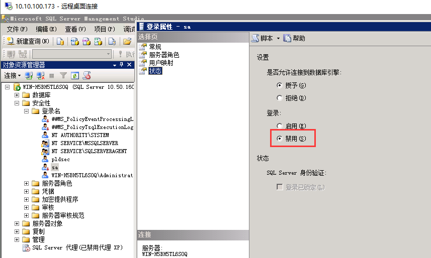

在SQLServer账户验证模式中，sa账户是大家众所周知的，并且也是内置的默认管理员账户，拥有最高的操作权限。

前面提到sa账户大家都熟悉，所以，一些别有用心的人也知道sa账户，这就给我们数据安全留下了隐患。

黑客会通过扫描程序在互联网上大量扫描，发现那些开着远程访问，并且使用sa账户的数据库服务器，使用穷举法不断尝试密码（暴力破解）。

#### 禁用sa账户

最直接的方法就是直接不使用这个sa账户，**禁用sa账户**。

##### sa账户是安装期间创建的原始登录名，并且始终具有principal_id=1和sid=0x01

查看sa账户是否已被禁用

```
SELECT name, is_disabled 
FROM sys.server_principals 
WHERE sid = 0x01 
AND is_disabled = 0;
```

不返回任何行则说明已禁用

禁用sa账户

```
ALTER LOGIN sa disable
```

或者通过ssms，安全性-登录名-找到sa右键属性-状态-登录禁用



#### 重命名sa账户

如果不想禁用sa账户，想使用这个sa账户，那建议**重命名sa账户**

```
ALTER LOGIN sa WITH NAME = <different_user>;
```

或者通过ssms，安全性-登录名-sa账户-右键重命名


这样设置之后，能够让黑客无法直接通过sa账户去进行暴力猜解数据库，很大程度上保障了数据库的安全性


**但是如果对编写程序和脚本已经使用了sa账户，则禁用或者重命名账户将阻止脚本和应用程序对数据库服务器进行身份验证并执行所需的任务或功能**

注释：

ALTER LOGIN用法参考

https://docs.microsoft.com/en-us/sql/t-sql/statements/alter-login-transact-sql?view=sql-server-2017

