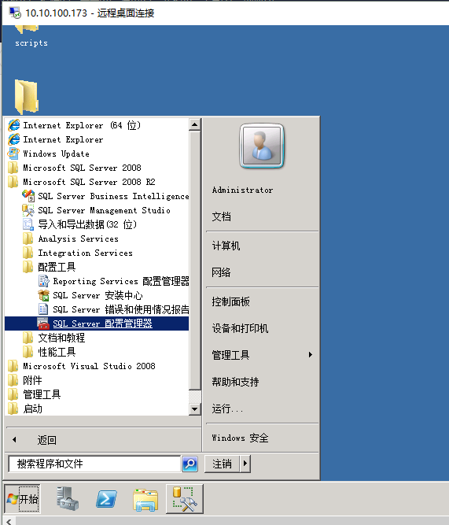
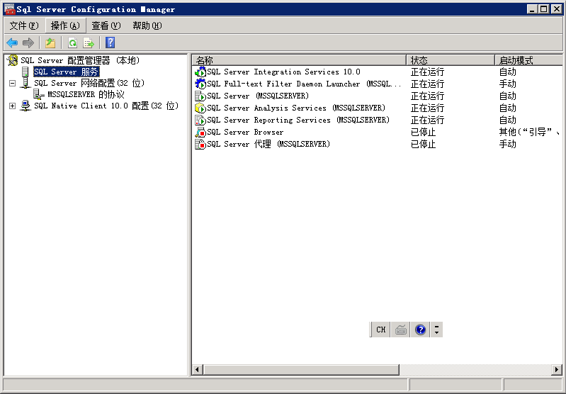
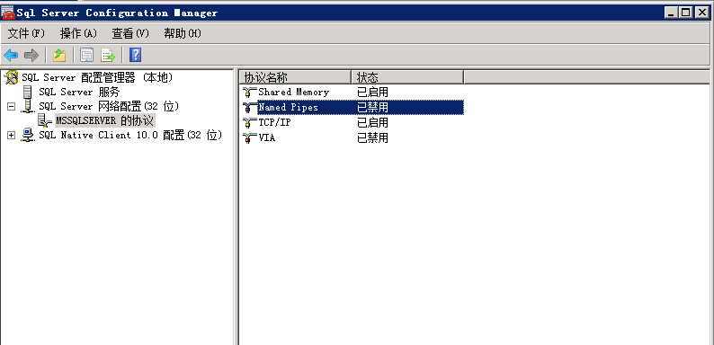
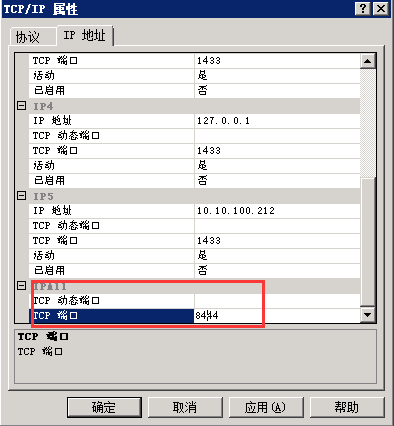
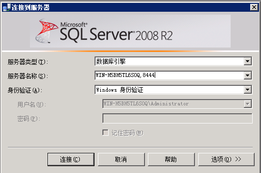
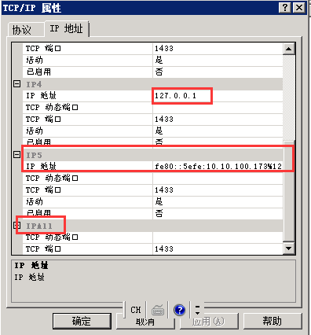

##### 使用默认端口号的问题

当你安装SQL Server时，默认示例监听的是1433端口。众所周知的，这是默认的端口号。因此，通常你会看到来自黑客对1433端口的攻击。所以为了最小化黑客通过默认端口来访问的潜在的威胁，**可以使用动态端口，或是非1433静态端口**

##### 配置SQL Server去监听特定端口

启动配置管理器，一旦启动SQL Server配置管理器，你就可以看到SQLServer网络配置节点

SQLServer配置管理器界面

在SQLServer网络配置下的MSSQLSERVER的协议下，可以看到四个协议，其中TCP/IP协议与VIA协议能够设置端口。**由于VIA（虚拟接口适配协议）需要与VIA硬件使用**。文章就介绍通用的TCP/IP端口设置。

选择TCP/IP协议右键属性，到**IP地址选项卡**。

如果协议选项卡侦听全部选项为是，则只需将IP地址选项卡的IPALL的静态端口改成非1433的端口，动态端口为空（注意不能合其他应用的端口重复）

如果协议选项卡侦听全部选项为否，则把其他需要使用的IP地址的端口进行更改成非1433端口

此时连接数据库的时候，就需要在**服务器名称后面带上设定的端口**

##### 如果是远程连接该数据库，还需要将防火墙开放修改后的端口

##### 需要重启SQLServer服务器才会生效

#### 拓展：

前面**协议选项卡**指定 SQL Server 是否侦听所有绑定到计算机网卡的 IP 地址。如果设置为“否”，则使用每个 IP 地址各自的属性对话框对各个 IP 地址进行配置。如果设置为“是”，则 IPAll 属性框的设置将应用于所有 IP 地址。默认值为“是”。

如果**协议选项卡**中的“全部侦听”为“否”，则每个IP地址可以有各自的属性。如果“已启用”设置为“否”，则该网卡被禁止侦听TCP/IP连接请求。
如果“协议”选项卡中已经设定了“全部侦听”，则IP地址选项卡只有IPALL属性框的设置有效。

##### 注：当全部侦听为否，且更改网卡IP的时候，需要在IP选项卡对应IP进行更改，否则无法启动SQLServer服务（即协议内IP地址与网卡IP不符合）

**静态端口**：SQL Server 的默认实例侦听端口 1433 的传入连接。可以出于安全性原因或根据客户端应用程序的请求来更改该端口。若要配置静态端口，**请将“TCP 动态端口”框保留为空**，并在“TCP 端口”框中提供一个可用的端口号。

SQL Server 数据库引擎可以侦听同一 IP 地址的多个端口，端口以逗号分隔的格式列出：1433,1500,1501。本字段最多允许 2047 个字符。

**动态端口**：默认情况下，命名实例（例如 \SQLExpress）被配置为侦听动态端口。若要配置动态端口，**请将“TCP 动态端口”框中输入0。**

客户端连接必须指定要连接的端口号。使用动态端口会增加通过防火墙连接 SQL Server 的复杂性，因为重新启动 SQL Server 时端口号可能会改变，从而需要更改防火墙设置。若要避免通过防火墙连接的问题，请将 SQL Server 配置为使用静态端口。

**SQL Server Browser**：由于每次启动 SQL Server 时端口号都可能会改变，因此 SQL Server 提供 SQL Server Browser 服务监视端口，并将客户端连接指向该实例的当前端口。
SQL Server Browser 服务 (sqlbrowser) 为数据库引擎和 SSAS 的每个实例提供实例名称和版本号。SQL 
Server Browser 随 SQL Server 一起安装，为该计算机上运行的早期版本的 SQL Server（从 SQL Server 
7.0 开始）提供此服务。

**如果有防火墙，请打开 UDP 1434 端口，SQL Server Browser 通过此端口侦听客户端的传入请求。**