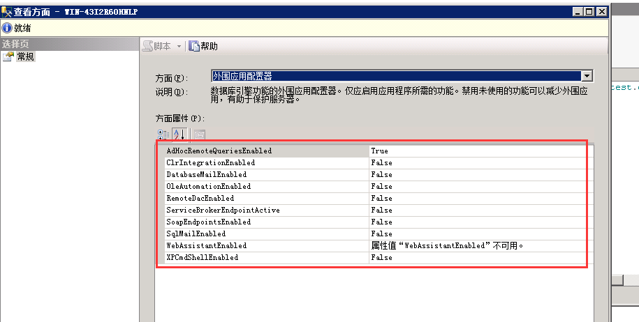

# 外围应用配置项




### 一、AdHocRemoteQueries

#### 开启**Ad Hoc Distributed Queries**

#### openrowset/opendatasource

#### 危害

- 如果允许的提供程序中有一个错误（例如缓冲区溢出）会危及您的安全性，那么这就是获取它的方法之一。危害系统
- 它可用于从网络上的受感染服务器连接到非受损服务器，该服务器通常不允许来自网络外部的外部连接。
- 它允许已经受到攻击的数据库向攻击者报告，提供用于启用进一步攻击和/或复制数据的其他信息。我把它作为三个问题中较小的一个，因为虽然它使复制数据和解码系统变得更容易，但它实际上并没有允许它们获得任何额外的权利或创建漏洞。

#### 拓展：

- ODBC

- JDBC

- OLE DB

- ADO

[参考文档](https://www.sqlservercentral.com/Forums/776793/Security-implications-of-allowing-Ad-hoc-distributed-queries)

### 二、OleAutomation

#### 开启Ole Automation procedures

#### OLE对象

#### SQLServer OLE自动化存储过程

- sp_OACreate 创建OLE对象
- sp_OAMethod 调用OLE对象方法

#### FileSystemObject、TextStream、File对象

#### OLE自动化示例

**新建文件与检测文件是否存在：**

```
DECLARE @ExpectedFolder VARCHAR(50)='C:\Users\Administrator\Desktop\'
DECLARE @ExpectedFilePrefix VARCHAR(10)='test'
DECLARE @ExpectedFullFileName VARCHAR(255)= 
               @ExpectedFolder + @ExpectedFilePrefix + '.txt'

DECLARE @returnCode INT
DECLARE @objectToken INT
DECLARE @CFToken INT
DECLARE @fileToken INT
DECLARE @txtToken INT
DECLARE @txt VARCHAR(255)

EXEC sp_OACreate 'Scripting.FileSystemObject',@objectToken OUTPUT 

exec sp_OAMethod @objectToken,'CreateTextFile',
                 @CFToken OUTPUT,@ExpectedFullFileName,'True'
SELECT @CFToken

exec sp_OAMethod @objectToken,'FileExists',
                 @returnCode OUTPUT,@ExpectedFullFileName
SELECT @returnCode
```

**读文件：**

```
exec sp_OAMethod @objectToken,'GetFile',
                 @fileToken OUTPUT,@ExpectedFullFileName
SELECT @fileToken

exec sp_OAMethod @fileToken,'OpenAsTextStream',
			     @txtToken OUTPUT,'1','-2'
SELECT @txtToken

exec sp_OAMethod @txtToken,'ReadAll',@txt OUTPUT
SELECT @txt
```

#### 危害

Ole Automation Procedures扩展存储过程允许在数据库访问权限控制之外执行主机可执行文件。恶意用户可能会利用此访问权限来破坏SQL Server数据库进程的完整性，从而控制主机操作系统进行其他恶意活动。

[参考文档](https://www.mssqltips.com/sqlservertip/3309/accessing-ole-and-com-objects-from-sql-server-using-ole-automation-stored-procedures/)

[微软OLE自动化存储过程文档](https://docs.microsoft.com/zh-cn/sql/relational-databases/system-stored-procedures/ole-automation-stored-procedures-transact-sql?view=sql-server-2017)

[微软FileSystemObject OLE对象文档](https://docs.microsoft.com/zh-cn/office/vba/language/reference/user-interface-help/filesystemobject-object)

### 三、XPCmdShell

