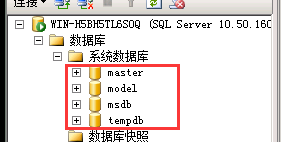
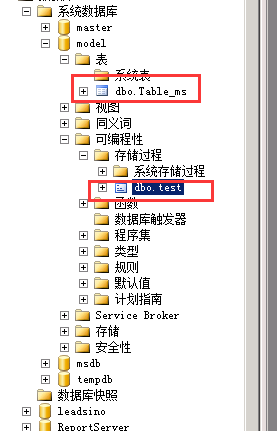
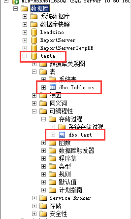
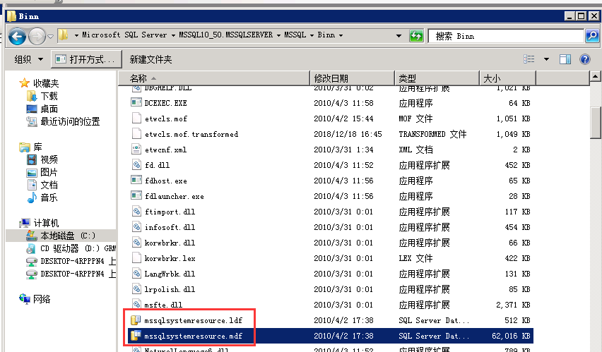

如图所示，进入每个SQLServer实例，一般都会有四个系统数据库，master、model、msdb、tempdb。

#### 1.master数据库

master数据库记录了SQL Server系统的所有系统信息。比如登录帐户，系统配置设置，SQL Server的初始化信息和其他系统数据及用户数相关信息。它记录所有其他的数据库，其中包括数据库文件的位置。如果它**不可用了，也意味着SQL Server无法启动**

#### 2.model数据库

model数据库用作在系统上创建所有数据库的模板。当系统检测到**CREATE DATABASE**（创建数据库）的SQL语句时，首先将model数据库中的内容来创建新数据库，然后再将创建新数据库的其他部分。也就是说，如果修改了model数据库，那么在这个SQL Server实例上面创建的新库将会把model内的所有部分复制到新库，包括表、存储过程等。（即，新库将继承model数据库的所有内容）

我们做个实验，在model库中建了一张表与一个存储过程

不需要重启实例（可能需要重启SMSS），直接新建一个数据库，比如新建一个test库，我们可以看到test库在没有任何新建操作，就已经有了表和存储过程。即新库继承了model库的所有内容

那我们以后不需要再建数据库，能否把model库删除？实际上是不可以的，因为SQL Server每次重启后都会创建tempdb，它也是系统数据库。既然是创建数据库，那么就需要复制model库。**所有如果没有model，SQL Server也是无法启动**。

#### 3.msdb数据库

msdb和master数据库的相似之处在于他们都是**记录信息的数据库**。只不过他是跟SQL Server代理程序的相关。比如报警、任务调度和记录操作员的操作提供存储空间。

#### 4.tempdb数据库

如名字所示，它是一个临时库，为所有临时表，临时存储过程及其他临时操作提供存储空间。tempdb数据库是全局资源，不管哪个数据库他们所建的临时表和存储过程都在tempdb上。

tempdb数据库在SQL Server每次重启的时候都重新创建，因此该数据库在系统启动时总是干净的。临时表和存储过程在连接断开时自动除去，而且当系统关闭后将没有任何连接处于活动状态，因此tempdb数据库中没有任何内容会从SQL Server的一个会话保存到另一个会话。

##### 注：还存在一个隐藏的Resource数据库记录系统表信息。（sqlserver2005引入）

Resource数据库是一个只读数据库，**包含SQL Server包括的系统对象（它包含了SQL server运行所需的所有的只读的关键系统表、元数据以及存储过程）。它不包含任何用户实例或数据库的任何信息，它只在安装新服务补丁时被写入。**系统对象在物理上保留在Resource数据库中，但在逻辑上显示在每个数据库sys架构中。

Resource数据库的物理文件名为 mssqlsystemresource.mdf和mssqlsystemresource.ldf。这些文件位于 <驱动器>:\Program Files\Microsoft SQL Server\MSSQL10_50.<instance_name>\MSSQL\Binn\ 中

每个 SQL Server 实例都具有一个（也是唯一的一个）关联的 mssqlsystemresource.mdf 文件，并且**实例间不共享此文件**。

