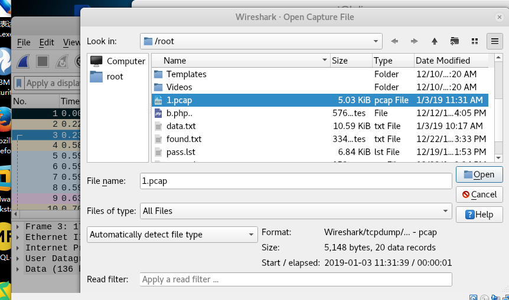
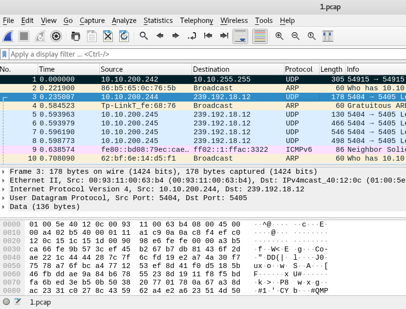

1.先在tcpdump上抓把保存到1.pcap文件内

```
tcpdump -i eth0 -w ./1.pcap
```

2.如果本地没有wireshark，需要下载。通过scp，ftp等方式。

```
scp root@10.10.100.212:/root/1.pcap /home/abc/1.pcap
```

将root目录下的1.pcap下载到本地的abc目录下

该命令会提示输入root密码

3.进入wireshark打开1.pcap，文件->选择1.pcap文件->打开



即可以查看刚刚抓到的数据包

